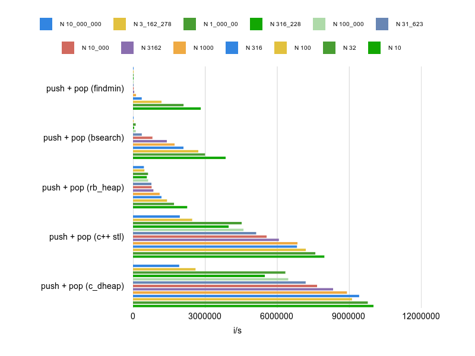

# DHeap - Fast d-ary heap for ruby

[](https://badge.fury.io/rb/d_heap)
[](https://github.com/nevans/d_heap/actions?query=workflow%3ACI)
[](https://codeclimate.com/github/nevans/d_heap/maintainability)

A fast [_d_-ary heap][d-ary heap] [priority queue] implementation for ruby,
implemented as a C extension.

With a regular queue, you expect "FIFO" behavior: first in, first out.  With a
stack you expect "LIFO": last in first out.  A priority queue has a score for
each element and elements are popped in order by score.  Priority queues are
often used in algorithms for e.g. [scheduling] of timers or bandwidth
management, for [Huffman coding], and various graph search algorithms such as
[Dijkstra's algorithm], [A* search], or [Prim's algorithm].

The _d_-ary heap data structure is a generalization of the [binary heap], in
which the nodes have _d_ children instead of 2.  This allows for "insert" and
"decrease priority" operations to be performed more quickly with the tradeoff of
slower delete minimum.  Additionally, _d_-ary heaps can have better memory cache
behavior than binary heaps, allowing them to run more quickly in practice
despite slower worst-case time complexity. In the worst case, a _d_-ary heap
requires only `O(log n / log d)` operations to push, with the tradeoff that pop
requires `O(d log n / log d)`.

Although you should probably just use the default _d_ value  of `4` (see the
analysis below), it's always advisable to benchmark your specific use-case.

[d-ary heap]: https://en.wikipedia.org/wiki/D-ary_heap
[priority queue]: https://en.wikipedia.org/wiki/Priority_queue
[binary heap]: https://en.wikipedia.org/wiki/Binary_heap
[scheduling]: https://en.wikipedia.org/wiki/Scheduling_(computing)
[Huffman coding]: https://en.wikipedia.org/wiki/Huffman_coding#Compression
[Dijkstra's algorithm]: https://en.wikipedia.org/wiki/Dijkstra%27s_algorithm#Using_a_priority_queue
[A* search]: https://en.wikipedia.org/wiki/A*_search_algorithm#Description
[Prim's algorithm]: https://en.wikipedia.org/wiki/Prim%27s_algorithm

## Usage

Quick reference:

* `heap << object` adds a value, with `Float(object)` as its score.
* `heap.push(object, score)` adds a value with an extrinsic score.
* `heap.pop` removes and returns the value with the minimum score.
* `heap.pop_lte(score)` pops if the minimum score is `<=` the provided score.
* `heap.peek` to view the minimum value without popping it.
* `heap.clear` to remove all items from the heap.
* `heap.empty?` returns true if the heap is empty.
* `heap.size` returns the number of items in the heap.

The basic API is `#push(object, score)` and `pop`.  If your values behave as
their own score, then you can push with `#<<`.  If the score changes while the
object is still in the heap, it will not be re-evaluated again.  The score must
either be `Integer` or `Float` or convertable to a `Float` via `Float(score)`
(i.e. it should implement `#to_f`).

```ruby
require "d_heap"

Task = Struct.new(:id, :time) do
  def to_f; time.to_f end
end
t1 = Task.new(1, Time.now + 5*60)
t2 = Task.new(2, Time.now + 50)
t3 = Task.new(3, Time.now + 60)
t4 = Task.new(4, Time.now +  5)

# if the object returns its own score via #to_f, "<<" is the simplest API
heap << t1 << t2

# or push with an explicit score
heap.push t3, t4.to_f
heap.push t4, t4 # score can be implicitly cast with Float

# peek and pop
heap.pop    # => #<struct Task id=4, time=2021-01-17 17:02:22.5574 -0500>
heap.pop    # => #<struct Task id=2, time=2021-01-17 17:03:07.5574 -0500>
heap.peek   # => #<struct Task id=3, time=2021-01-17 17:03:17.5574 -0500>
heap.pop    # => #<struct Task id=3, time=2021-01-17 17:03:17.5574 -0500>
heap.pop    # => #<struct Task id=1, time=2021-01-17 17:07:17.5574 -0500>
heap.empty? # => true
heap.pop    # => nil
```

Constraining scores to numeric values gives more than 50% speedup under some
benchmarks!  _n.b._ `Integer` _scores must have an absolute value that fits
into_ `unsigned long long`. _This is architecture dependant but on an IA-64
system this is 64 bits, which gives a range of -18,446,744,073,709,551,615 to
+18446744073709551615.  Comparing arbitary objects via_ `a <=> b` _was the
original design and may be added back in a future version,_ if (and only if) _it
can be done without impacting the speed of numeric comparisons._

```ruby
heap.clear

# The score can be derived from the value by using to_f.
# "a <=> b" is *much* slower than comparing numbers, so it isn't used.
class Event
  include Comparable
  attr_reader :time, :payload
  alias_method :to_time, :time

  def initialize(time, payload)
    @time = time.to_time
    @payload = payload
    freeze
  end

  def to_f
    time.to_f
  end

  def <=>(other)
    to_f <=> other.to_f
  end
end

heap << comparable_max # sorts last, using <=>
heap << comparable_min # sorts first, using <=>
heap << comparable_mid # sorts in the middle, using <=>
heap.pop    # => comparable_min
heap.pop    # => comparable_mid
heap.pop    # => comparable_max
heap.empty? # => true
heap.pop    # => nil
```

You can also pass a value into `#pop(max)` which will only pop if the minimum
score is less than or equal to `max`.

Read the [API documentation] for more detailed documentation and examples.

[API documentation]: https://rubydoc.info/gems/d_heap/DHeap

## Installation

Add this line to your application's Gemfile:

```ruby
gem 'd_heap'
```

And then execute:

    $ bundle install

Or install it yourself as:

    $ gem install d_heap

## Motivation

One naive approach to a priority queue is to maintain an array in sorted order.
This can be very simply implemented in ruby with `Array#bseach_index` +
`Array#insert`.  This can be very fast—`Array#pop` is `O(1)`—but the worst-case
for insert is `O(n)` because it may need to `memcpy` a significant portion of
the array.

The standard way to implement a priority queue is with a binary heap.  Although
this increases the time for `pop`, it converts the amortized time per push + pop
from `O(n)` to `O(d log n / log d)`.

However, I was surprised to find that—at least for some benchmarks—my pure ruby
heap implementation was much slower than inserting into and popping from a fully
sorted array.  The reasons for this surprising result: Although it is `O(n)`,
`memcpy` has a _very_ small constant factor, and calling `<=>` from ruby code
has relatively _much_ larger constant factors.  If your queue contains only a
few thousand items, the overhead of those extra calls to `<=>` is _far_ more
than occasionally calling `memcpy`.  In the worst case, a _d_-heap will require
`d + 1` times more comparisons for each push + pop than a `bsearch` + `insert`
sorted array.

Moving the sift-up and sift-down code into C helps some.  But much more helpful
is optimizing the comparison of numeric scores, so `a <=> b` never needs to be
called.  I'm hopeful that MJIT will eventually obsolete this C-extension.  This
can be hotspot code, and a basic ruby implementation could perform well if `<=>`
had much lower overhead.

## Analysis

### Time complexity

There are two fundamental heap operations: sift-up (used by push) and sift-down
(used by pop).

* Both sift operations can perform as many as `log n / log d` swaps, as the
  element may sift from the bottom of the tree to the top, or vice versa.
* Sift-up performs a single comparison per swap: `O(1)`.
  So pushing a new element is `O(log n / log d)`.
* Swap down performs as many as d comparions per swap: `O(d)`.
  So popping the min element is `O(d log n / log d)`.

Assuming every inserted element is eventually deleted from the root, d=4
requires the fewest comparisons for combined insert and delete:

* (1 + 2) lg 2 = 4.328085
* (1 + 3) lg 3 = 3.640957
* (1 + 4) lg 4 = 3.606738
* (1 + 5) lg 5 = 3.728010
* (1 + 6) lg 6 = 3.906774
* etc...

Leaf nodes require no comparisons to shift down, and higher values for d have
higher percentage of leaf nodes:

* d=2 has ~50% leaves,
* d=3 has ~67% leaves,
* d=4 has ~75% leaves,
* and so on...

See https://en.wikipedia.org/wiki/D-ary_heap#Analysis for deeper analysis.

### Space complexity

Space usage is linear, regardless of d.  However higher d values may
provide better cache locality.  Because the heap is a complete binary tree, the
elements can be stored in an array, without the need for tree or list pointers.

Ruby can compare Numeric values _much_ faster than other ruby objects, even if
those objects simply delegate comparison to internal Numeric values.  And it is
often useful to use external scores for otherwise uncomparable values.  So
`DHeap` uses twice as many entries (one for score and one for value)
as an array which only stores values.

## Benchmarks

_See `bin/benchmarks` and `docs/benchmarks.txt`, as well as `bin/profile` and
`docs/profile.txt` for more details or updated results. These benchmarks were
measured with v0.5.0 and ruby 2.7.2 without MJIT enabled._



These benchmarks use very simple implementations for a pure-ruby heap and an
array that is kept sorted using `Array#bsearch_index` and `Array#insert`.  For
comparison, an alternate implementation `Array#min` and `Array#delete_at` is
also shown.

Three different scenarios are measured:
 * push N values but never pop (clearing between each set of pushes).
 * push N values and then pop N values.
   Although this could be used for heap sort, we're unlikely to choose heap sort
   over Ruby's quick sort implementation. I'm using this scenario to represent
   the amortized cost of creating a heap and (eventually) draining it.
 * For a heap of size N, repeatedly push and pop while keeping a stable size.
   This is a _very simple_ approximation for how most scheduler/timer heaps
   would be used. Usually when a timer fires it will be quickly replaced by a
   new timer, and the overall count of timers will remain roughly stable.

In these benchmarks, `DHeap` runs faster than all other implementations for
every scenario and every value of N, although the difference is much more
noticable at higher values of N.  The pure ruby heap implementation is
competitive for `push` alone at every value of N, but is significantly slower
than bsearch + insert for push + pop until N is _very_ large (somewhere between
10k and 100k)!

For very small N values the benchmark implementations,  `DHeap` runs faster than
the other implementations for each scenario, although the difference is still
relatively small.  The pure ruby binary heap is 2x or more slower than bsearch +
insert for common common push/pop scenario.

    == push N (N=5) ==========================================================
    push N (c_dheap):   1969700.7 i/s
    push N (c++ stl):   1049738.1 i/s - 1.88x  slower
    push N (rb_heap):    928435.2 i/s - 2.12x  slower
    push N (bsearch):    921060.0 i/s - 2.14x  slower

    == push N then pop N (N=5) ===============================================
    push N + pop N (c_dheap):   1375805.0 i/s
    push N + pop N (c++ stl):   1134997.5 i/s - 1.21x  slower
    push N + pop N (findmin):    862913.1 i/s - 1.59x  slower
    push N + pop N (bsearch):    762887.1 i/s - 1.80x  slower
    push N + pop N (rb_heap):    506890.4 i/s - 2.71x  slower

    == Push/pop with pre-filled queue of size=N (N=5) ========================
    push + pop (c_dheap):   9044435.5 i/s
    push + pop (c++ stl):   7534583.4 i/s - 1.20x  slower
    push + pop (findmin):   5026155.1 i/s - 1.80x  slower
    push + pop (bsearch):   4300260.0 i/s - 2.10x  slower
    push + pop (rb_heap):   2299499.7 i/s - 3.93x  slower

By N=21, `DHeap` has pulled significantly ahead of bsearch + insert for all
scenarios, but the pure ruby heap is still slower than every other
implementation—even resorting the array after every `#push`—in any scenario that
uses `#pop`.

    == push N (N=21) =========================================================
    push N (c_dheap):    464231.4 i/s
    push N (c++ stl):    305546.7 i/s - 1.52x  slower
    push N (rb_heap):    202803.7 i/s - 2.29x  slower
    push N (bsearch):    168678.7 i/s - 2.75x  slower

    == push N then pop N (N=21) ==============================================
    push N + pop N (c_dheap):    298350.3 i/s
    push N + pop N (c++ stl):    252227.1 i/s - 1.18x  slower
    push N + pop N (findmin):    161998.7 i/s - 1.84x  slower
    push N + pop N (bsearch):    143432.3 i/s - 2.08x  slower
    push N + pop N (rb_heap):     79622.1 i/s - 3.75x  slower

    == Push/pop with pre-filled queue of size=N (N=21) =======================
    push + pop (c_dheap):   8855093.4 i/s
    push + pop (c++ stl):   7223079.5 i/s - 1.23x  slower
    push + pop (findmin):   4542913.7 i/s - 1.95x  slower
    push + pop (bsearch):   3461802.4 i/s - 2.56x  slower
    push + pop (rb_heap):   1845488.7 i/s - 4.80x  slower

At higher values of N, a heaps logarithmic growth leads to only a little
slowdown of `#push`, while insert's linear growth causes it to run noticably
slower and slower.  But because `#pop` is `O(1)` for a sorted array and `O(d log
n / log d)` for a heap, scenarios involving both `#push` and `#pop` remain
relatively close, and bsearch + insert still runs faster than a pure ruby heap,
even up to queues with 10k items.  But as queue size increases beyond than that,
the linear time compexity to keep a sorted array dominates.

    == push + pop (rb_heap)
    queue size =    10000:    736618.2 i/s
    queue size =    25000:    670186.8 i/s - 1.10x  slower
    queue size =    50000:    618156.7 i/s - 1.19x  slower
    queue size =   100000:    579250.7 i/s - 1.27x  slower
    queue size =   250000:    572795.0 i/s - 1.29x  slower
    queue size =   500000:    543648.3 i/s - 1.35x  slower
    queue size =  1000000:    513523.4 i/s - 1.43x  slower
    queue size =  2500000:    460848.9 i/s - 1.60x  slower
    queue size =  5000000:    445234.5 i/s - 1.65x  slower
    queue size = 10000000:    423119.0 i/s - 1.74x  slower

    == push + pop (bsearch)
    queue size =    10000:    786334.2 i/s
    queue size =    25000:    364963.8 i/s - 2.15x  slower
    queue size =    50000:    200520.6 i/s - 3.92x  slower
    queue size =   100000:     88607.0 i/s - 8.87x  slower
    queue size =   250000:     34530.5 i/s - 22.77x  slower
    queue size =   500000:     17965.4 i/s - 43.77x  slower
    queue size =  1000000:      5638.7 i/s - 139.45x  slower
    queue size =  2500000:      1302.0 i/s - 603.93x  slower
    queue size =  5000000:       592.0 i/s - 1328.25x  slower
    queue size = 10000000:       288.8 i/s - 2722.66x  slower

    == push + pop (c_dheap)
    queue size =    10000:   7311366.6 i/s
    queue size =    50000:   6737824.5 i/s - 1.09x  slower
    queue size =    25000:   6407340.6 i/s - 1.14x  slower
    queue size =   100000:   6254396.3 i/s - 1.17x  slower
    queue size =   250000:   5917684.5 i/s - 1.24x  slower
    queue size =   500000:   5126307.6 i/s - 1.43x  slower
    queue size =  1000000:   4403494.1 i/s - 1.66x  slower
    queue size =  2500000:   3304088.2 i/s - 2.21x  slower
    queue size =  5000000:   2664897.7 i/s - 2.74x  slower
    queue size = 10000000:   2137927.6 i/s - 3.42x  slower

## Profiling

_n.b. `Array#fetch` is reading the input data, external to heap operations.
These benchmarks use integers for all scores, which enables significantly faster
comparisons.  If `a <=> b` were used instead, then the difference between push
and pop would be much larger.  And ruby's `Tracepoint` impacts these different
implementations differently.  So we can't use these profiler results for
comparisons between implementations.  A sampling profiler would be needed for
more accurate relative measurements._

It's informative to look at the `ruby-prof` results for a simple binary search +
insert implementation, repeatedly pushing and popping to a large heap. In
particular, even with 1000 members, the linear `Array#insert` is _still_ faster
than the logarithmic `Array#bsearch_index`. At this scale, ruby comparisons are
still (relatively) slow and `memcpy` is (relatively) quite fast!

    %self      total      self      wait     child     calls  name                           location
    34.79      2.222     2.222     0.000     0.000  1000000   Array#insert
    32.59      2.081     2.081     0.000     0.000  1000000   Array#bsearch_index
    12.84      6.386     0.820     0.000     5.566        1   DHeap::Benchmarks::Scenarios#repeated_push_pop d_heap/benchmarks.rb:77
    10.38      4.966     0.663     0.000     4.303  1000000   DHeap::Benchmarks::BinarySearchAndInsert#<< d_heap/benchmarks/implementations.rb:61
     5.38      0.468     0.343     0.000     0.125  1000000   DHeap::Benchmarks::BinarySearchAndInsert#pop d_heap/benchmarks/implementations.rb:70
     2.06      0.132     0.132     0.000     0.000  1000000   Array#fetch
     1.95      0.125     0.125     0.000     0.000  1000000   Array#pop

Contrast this with a simplistic pure-ruby implementation of a binary heap:

    %self      total      self      wait     child     calls  name                           location
    48.52      8.487     8.118     0.000     0.369  1000000   DHeap::Benchmarks::NaiveBinaryHeap#pop d_heap/benchmarks/implementations.rb:96
    42.94      7.310     7.184     0.000     0.126  1000000   DHeap::Benchmarks::NaiveBinaryHeap#<< d_heap/benchmarks/implementations.rb:80
     4.80     16.732     0.803     0.000    15.929        1   DHeap::Benchmarks::Scenarios#repeated_push_pop d_heap/benchmarks.rb:77

You can see that it spends almost more time in pop than it does in push.  That
is expected behavior for a heap: although both are O(log n), pop is
significantly more complex, and has _d_ comparisons per layer.

And `DHeap` shows a similar comparison between push and pop, although it spends
half of its time in the benchmark code (which is written in ruby):

    %self      total      self      wait     child     calls  name                           location
    43.09      1.685     0.726     0.000     0.959        1   DHeap::Benchmarks::Scenarios#repeated_push_pop d_heap/benchmarks.rb:77
    26.05      0.439     0.439     0.000     0.000  1000000   DHeap#<<
    23.57      0.397     0.397     0.000     0.000  1000000   DHeap#pop
     7.29      0.123     0.123     0.000     0.000  1000000   Array#fetch

### Timers

Additionally, when used to sort timers, we can reasonably assume that:
 * New timers usually sort after most existing timers.
 * Most timers will be canceled before executing.
 * Canceled timers usually sort after most existing timers.

So, if we are able to delete an item without searching for it, by keeping a map
of positions within the heap, most timers can be inserted and deleted in O(1)
time.  Canceling a non-leaf timer can be further optimized by marking it as
canceled without immediately removing it from the heap.  If the timer is
rescheduled before we garbage collect, adjusting its position will usually be
faster than a delete and re-insert.

## Alternative data structures

As always, you should run benchmarks with your expected scenarios to determine
which is right.

Depending on what you're doing, maintaining a sorted `Array` using
`#bsearch_index` and `#insert` might be just fine!  As discussed above, although
it is `O(n)` for insertions, `memcpy` is so fast on modern hardware that this
may not matter.  Also, if you can arrange for insertions to occur near the end
of the array, that could significantly reduce the `memcpy` overhead even more.

More complex heap varients, e.g. [Fibonacci heap], can allow heaps to be merged
as well as lower amortized time.

[Fibonacci heap]: https://en.wikipedia.org/wiki/Fibonacci_heap

If it is important to be able to quickly enumerate the set or find the ranking
of values in it, then you may want to use a self-balancing binary search tree
(e.g. a [red-black tree]) or a [skip-list].

[red-black tree]: https://en.wikipedia.org/wiki/Red%E2%80%93black_tree
[skip-list]: https://en.wikipedia.org/wiki/Skip_list

[Hashed and Heirarchical Timing Wheels][timing wheels] (or some variant in that
family of data structures) can be constructed to have effectively `O(1)` running
time in most cases.  Although the implementation for that data structure is more
complex than a heap, it may be necessary for enormous values of N.

[timing wheels]: http://www.cs.columbia.edu/~nahum/w6998/papers/ton97-timing-wheels.pdf

## TODOs...

_TODO:_ Also ~~included is~~ _will include_ `DHeap::Set`, which augments the
basic heap with an internal `Hash`, which maps a set of values to scores.
loosely inspired by go's timers.  e.g: It lazily sifts its heap after deletion
and adjustments, to achieve faster average runtime for *add* and *cancel*
operations.

_TODO:_ Also ~~included is~~ _will include_ `DHeap::Lazy`, which contains some
features that are loosely inspired by go's timers.  e.g: It lazily sifts its
heap after deletion and adjustments, to achieve faster average runtime for *add*
and *cancel* operations.

Additionally, I was inspired by reading go's "timer.go" implementation to
experiment with a 4-ary heap instead of the traditional binary heap.  In the
case of timers, new timers are usually scheduled to run after most of the
existing timers.  And timers are usually canceled before they have a chance to
run. While a binary heap holds 50% of its elements in its last layer, 75% of a
4-ary heap will have no children.  That diminishes the extra comparison overhead
during sift-down.

## Development

After checking out the repo, run `bin/setup` to install dependencies. Then, run
`rake spec` to run the tests. You can also run `bin/console` for an interactive
prompt that will allow you to experiment.

To install this gem onto your local machine, run `bundle exec rake install`. To
release a new version, update the version number in `version.rb`, and then run
`bundle exec rake release`, which will create a git tag for the version, push
git commits and tags, and push the `.gem` file to
[rubygems.org](https://rubygems.org).

## Contributing

Bug reports and pull requests are welcome on GitHub at
https://github.com/nevans/d_heap. This project is intended to be a safe,
welcoming space for collaboration, and contributors are expected to adhere to
the [code of
conduct](https://github.com/nevans/d_heap/blob/master/CODE_OF_CONDUCT.md).

## License

The gem is available as open source under the terms of the [MIT
License](https://opensource.org/licenses/MIT).

## Code of Conduct

Everyone interacting in the DHeap project's codebases, issue trackers, chat
rooms and mailing lists is expected to follow the [code of
conduct](https://github.com/nevans/d_heap/blob/master/CODE_OF_CONDUCT.md).
