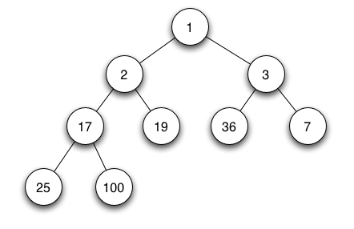
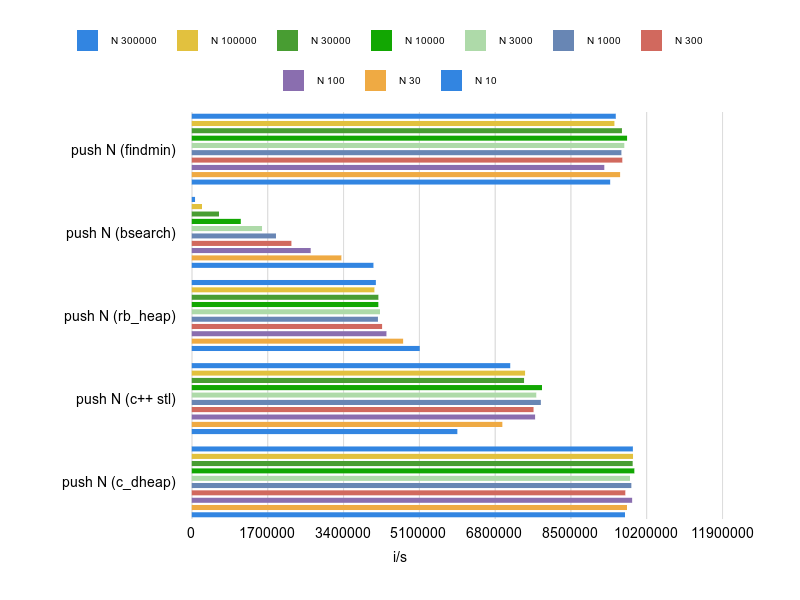

# DHeap - Fast d-ary heap for ruby

[](https://badge.fury.io/rb/d_heap)
[](https://github.com/nevans/d_heap/actions?query=workflow%3ACI)
[](https://codeclimate.com/github/nevans/d_heap/maintainability)

A fast [_d_-ary heap][d-ary heap] [priority queue] implementation for ruby,
implemented as a C extension.

A regular queue has "FIFO" behavior: first in, first out.  A stack is "LIFO":
last in first out.  A priority queue pushes each element with a score and pops
out in order by score.  Priority queues are often used in algorithms for e.g.
[scheduling] of timers or bandwidth management, for [Huffman coding], and for
various graph search algorithms such as [Dijkstra's algorithm], [A* search], or
[Prim's algorithm].

From [wikipedia](https://en.wikipedia.org/wiki/Heap_(data_structure)):
> A heap is a specialized tree-based data structure which is essentially an
> almost complete tree that satisfies the heap property: in a min heap, for any
> given node C, if P is a parent node of C, then the key (the value) of P is
> less than or equal to the key of C. The node at the "top" of the heap (with no
> parents) is called the root node.



The _d_-ary heap data structure is a generalization of a [binary heap] in which
each node has _d_ children instead of 2.  This speeds up "push" or "decrease
priority" operations (`O(log n / log d)`) with the tradeoff of slower "pop" or
"increase priority" (`O(d log n / log d)`).  Additionally, _d_-ary heaps can
have better memory cache behavior than binary heaps, letting them run more
quickly in practice.

Although the default _d_ value will usually perform best (see the time
complexity analysis below), it's always advisable to benchmark your specific
use-case.  In particular, if you push items more than you pop, higher values for
_d_ can give a faster total runtime.

[d-ary heap]: https://en.wikipedia.org/wiki/D-ary_heap
[priority queue]: https://en.wikipedia.org/wiki/Priority_queue
[binary heap]: https://en.wikipedia.org/wiki/Binary_heap
[scheduling]: https://en.wikipedia.org/wiki/Scheduling_(computing)
[Huffman coding]: https://en.wikipedia.org/wiki/Huffman_coding#Compression
[Dijkstra's algorithm]: https://en.wikipedia.org/wiki/Dijkstra%27s_algorithm#Using_a_priority_queue
[A* search]: https://en.wikipedia.org/wiki/A*_search_algorithm#Description
[Prim's algorithm]: https://en.wikipedia.org/wiki/Prim%27s_algorithm

## Installation

Add this line to your application's Gemfile:

```ruby
gem 'd_heap'
```

And then execute:

    $ bundle install

Or install it yourself as:

    $ gem install d_heap

## Usage

The basic API is `#push(object, score)` and `#pop`.  Please read the [full
documentation] for more details.  The score must be convertable to a `Float` via
`Float(score)` (i.e. it should properly implement `#to_f`).

Quick reference for the most common methods:

* `heap << object` adds a value, using `Float(object)` as its intrinsic score.
* `heap.push(object, score)` adds a value with an extrinsic score.
* `heap.peek` to view the minimum value without popping it.
* `heap.pop` removes and returns the value with the minimum score.
* `heap.pop_below(max_score)` pops only if the next score is `<` the argument.
* `heap.clear` to remove all items from the heap.
* `heap.empty?` returns true if the heap is empty.
* `heap.size` returns the number of items in the heap.

### Examples

```ruby
# create some example objects to place in our heap
Task = Struct.new(:id, :time) do
  def to_f; time.to_f end
end
t1 = Task.new(1, Time.now + 5*60)
t2 = Task.new(2, Time.now + 50)
t3 = Task.new(3, Time.now + 60)
t4 = Task.new(4, Time.now +  5)

# create the heap
require "d_heap"
heap = DHeap.new

# push with an explicit score (which might be extrinsic to the value)
heap.push t1, t1.to_f

# the score will be implicitly cast with Float, so any object with #to_f
heap.push t2, t2

# if the object has an intrinsic score via #to_f, "<<" is the simplest API
heap << t3 << t4

# pop returns the lowest scored item, and removes it from the heap
heap.pop    # => #<struct Task id=4, time=2021-01-17 17:02:22.5574 -0500>
heap.pop    # => #<struct Task id=2, time=2021-01-17 17:03:07.5574 -0500>

# peek returns the lowest scored item, without removing it from the heap
heap.peek   # => #<struct Task id=3, time=2021-01-17 17:03:17.5574 -0500>
heap.pop    # => #<struct Task id=3, time=2021-01-17 17:03:17.5574 -0500>

# pop_lte handles the common "h.pop if h.peek_score < max" pattern
heap.pop_lte(Time.now + 65) # => nil

# the heap size can be inspected with size and empty?
heap.empty? # => false
heap.size   # => 1
heap.pop    # => #<struct Task id=1, time=2021-01-17 17:07:17.5574 -0500>
heap.empty? # => true
heap.size   # => 0

# popping from an empty heap returns nil
heap.pop    # => nil
```

Please see the [full documentation] for more methods and more examples.

[full documentation]: https://rubydoc.info/gems/d_heap/DHeap

### DHeap::Map

`DHeap::Map` augments the heap with an internal `Hash`, mapping objects to their
index in the heap.  For simple push/pop this a bit slower than a normal `DHeap`
heap, but it can enable huge speed-ups for algorithms that need to adjust scores
after they've been added, e.g.  [Dijkstra's algorithm].  It adds the following:

* a uniqueness constraint, by `#hash` value
* `#[obj] # => score` or `#score(obj)` in `O(1)`
* `#[obj] = new_score` or `#rescore(obj, score)` in `O(d log n / log d)`
* TODO:
  * optionally unique by object identity
  * `#delete(obj)` in `O(d log n / log d)` (TODO)

## Scores

If a score changes while the object is still in the heap, it will not be
re-evaluated again.

Constraining scores to `Float` gives enormous performance benefits.  n.b.
very large `Integer` values will lose precision when converted to `Float`.  This
is compiler and architecture dependant but with gcc on an IA-64 system, `Float`
is 64 bits with a 53-bit mantissa, which gives a range of -9,007,199,254,740,991
to +9,007,199,254,740,991, which is _not_ enough to store the precise POSIX
time since the epoch in nanoseconds.  This can be worked around by adding a
bias, but probably it's good enough for most usage.

_Comparing arbitary objects via_ `a <=> b` _was the original design and may be
added back in a future version,_ if (and only if) _it can be done without
impacting the speed of numeric comparisons._

## Thread safety

`DHeap` is _not_ thread-safe, so concurrent access from multiple threads need to
take precautions such as locking access behind a mutex.

## Benchmarks

_See full benchmark output in subdirs of `benchmarks`.  See also or updated
results. These benchmarks were measured with an Intel Core i7-1065G7 8x3.9GHz
with d_heap v0.5.0 and ruby 2.7.2 without MJIT enabled._

### Implementations

 * **findmin** -
    A very fast `O(1)` push using `Array#push` onto an unsorted Array, but a
    very slow `O(n)` pop using `Array#min`, `Array#rindex(min)` and
    `Array#delete_at(min_index)`.  Push + pop is still fast for `n < 100`, but
    unusably slow for `n > 1000`.

 * **bsearch** -
    A simple implementation with a slow `O(n)` push using `Array#bsearch` +
    `Array#insert` to maintain a sorted Array, but a very fast `O(1)` pop with
    `Array#pop`.  It is still relatively fast for `n < 10000`, but its linear
    time complexity really destroys it after that.

 * **rb_heap** -
    A pure ruby binary min-heap that has been tuned for performance by making
    few method calls and allocating and assigning as few variables as possible.
    It runs in `O(log n)` for both push and pop, although pop is slower than
    push by a constant factor.  Its much higher constant factors makes it lose
    to `bsearch` push + pop for `n < 10000` but it holds steady with very little
    slowdown even with `n > 10000000`.

 * **c++ stl** -
    A thin wrapper around the [priority_queue_cxx gem] which uses the [C++ STL
    priority_queue].  The wrapper is simply to provide compatibility with the
    other benchmarked implementations, but it should be possible to speed this
    up a little bit by benchmarking the `priority_queue_cxx` API directly.  It
    has the same time complexity as rb_heap but its much lower constant
    factors allow it to easily outperform `bsearch`.

 * **c_dheap** -
    A {DHeap} instance with the default `d` value of `4`.  It has the same time
    complexity as `rb_heap` and `c++ stl`, but is faster than both in every
    benchmarked scenario.

[priority_queue_cxx gem]: https://rubygems.org/gems/priority_queue_cxx
[C++ STL priority_queue]: http://www.cplusplus.com/reference/queue/priority_queue/

### Scenarios

Each benchmark increases N exponentially, either by √1̅0̅ or approximating
(alternating between x3 and x3.333) in order to simplify keeping loop counts
evenly divisible by N.

#### push N items

This measures the _average time per insert_ to create a queue of size N
(clearing the queue once it reaches that size).  Use cases which push (or
decrease) more values than they pop, e.g.  [Dijkstra's algorithm] or [Prim's
algorithm] when the graph has more edges than verticies, may want to pay more
attention to this benchmark.



    == push N (N=100) ==========================================================
    push N (c_dheap):  10522662.6 i/s
    push N (findmin):   9980622.3 i/s - 1.05x  slower
    push N (c++ stl):   7991608.3 i/s - 1.32x  slower
    push N (rb_heap):   4607849.4 i/s - 2.28x  slower
    push N (bsearch):   2769106.2 i/s - 3.80x  slower
    == push N (N=10,000) =======================================================
    push N (c_dheap):  10444588.3 i/s
    push N (findmin):  10191797.4 i/s - 1.02x  slower
    push N (c++ stl):   8210895.4 i/s - 1.27x  slower
    push N (rb_heap):   4369252.9 i/s - 2.39x  slower
    push N (bsearch):   1213580.4 i/s - 8.61x  slower
    == push N (N=1,000,000) ====================================================
    push N (c_dheap):  10342183.7 i/s
    push N (findmin):   9963898.8 i/s - 1.04x  slower
    push N (c++ stl):   7891924.8 i/s - 1.31x  slower
    push N (rb_heap):   4350116.0 i/s - 2.38x  slower

All three heap implementations have little to no perceptible slowdown for `N >
100`.  But `DHeap` runs faster than `Array#push` to an unsorted array (findmin)!

#### push then pop N items

This measures the _average_ for a push **or** a pop, filling up a queue with N
items and then draining that queue until empty.  It represents the amortized
cost of balanced pushes and pops to fill a heap and drain it.


    == push N then pop N (N=100) ===============================================
    push N + pop N (c_dheap):  10954469.2 i/s
    push N + pop N (c++ stl):   9317140.2 i/s - 1.18x  slower
    push N + pop N (bsearch):   4808770.2 i/s - 2.28x  slower
    push N + pop N (findmin):   4321411.9 i/s - 2.53x  slower
    push N + pop N (rb_heap):   2467417.0 i/s - 4.44x  slower
    == push N then pop N (N=10,000) ============================================
    push N + pop N (c_dheap):   8083962.7 i/s
    push N + pop N (c++ stl):   7365661.8 i/s - 1.10x  slower
    push N + pop N (bsearch):   2257047.9 i/s - 3.58x  slower
    push N + pop N (rb_heap):   1439204.3 i/s - 5.62x  slower
    == push N then pop N (N=1,000,000) =========================================
    push N + pop N (c++ stl):   5274657.5 i/s
    push N + pop N (c_dheap):   4731117.9 i/s - 1.11x  slower
    push N + pop N (rb_heap):    976688.6 i/s - 5.40x  slower

At N=100 findmin still beats a pure-ruby heap. But above that it slows down too
much to be useful.  At N=10k, bsearch still beats a pure ruby heap, but above
30k it slows down too much to be useful.  `DHeap` consistently runs 4.5-5.5x
faster than the pure ruby heap.

#### push & pop on N-item heap

This measures the combined time to push once and pop once, which is done
repeatedly while keeping a stable heap size of N.  Its an approximation for
scenarios which reach a stable size and then plateau with balanced pushes and
pops.  E.g. timers and timeouts will often reschedule themselves or replace
themselves with new timers or timeouts, maintaining a roughly stable total count
of timers.


             push + pop (findmin)
                N 10:   5480288.0 i/s
               N 100:   2595178.8 i/s - 2.11x  slower
              N 1000:    224813.9 i/s - 24.38x  slower
             N 10000:     12630.7 i/s - 433.89x  slower
            N 100000:      1097.3 i/s - 4994.31x  slower
           N 1000000:       135.9 i/s - 40313.05x  slower
          N 10000000:        12.9 i/s - 425838.01x  slower

             push + pop (bsearch)
                N 10:   3931408.4 i/s
               N 100:   2904181.8 i/s - 1.35x  slower
              N 1000:   2203157.1 i/s - 1.78x  slower
             N 10000:   1209584.9 i/s - 3.25x  slower
            N 100000:     81121.4 i/s - 48.46x  slower
           N 1000000:      5356.0 i/s - 734.02x  slower
          N 10000000:       281.9 i/s - 13946.33x  slower

             push + pop (rb_heap)
                N 10:   2325816.5 i/s
               N 100:   1603540.3 i/s - 1.45x  slower
              N 1000:   1262515.2 i/s - 1.84x  slower
             N 10000:    950389.3 i/s - 2.45x  slower
            N 100000:    732548.8 i/s - 3.17x  slower
           N 1000000:    673577.8 i/s - 3.45x  slower
          N 10000000:    467512.3 i/s - 4.97x  slower

             push + pop (c++ stl)
                N 10:   7706818.6 i/s - 1.01x  slower
               N 100:   7393127.3 i/s - 1.05x  slower
              N 1000:   6898781.3 i/s - 1.13x  slower
             N 10000:   5731130.5 i/s - 1.36x  slower
            N 100000:   4842393.2 i/s - 1.60x  slower
           N 1000000:   4170936.4 i/s - 1.86x  slower
          N 10000000:   2737146.6 i/s - 2.84x  slower

             push + pop (c_dheap)
                N 10:  10196454.1 i/s
               N 100:   9668679.8 i/s - 1.05x  slower
              N 1000:   9339557.0 i/s - 1.09x  slower
             N 10000:   8045103.0 i/s - 1.27x  slower
            N 100000:   7150276.7 i/s - 1.43x  slower
           N 1000000:   6490261.6 i/s - 1.57x  slower
          N 10000000:   3734856.5 i/s - 2.73x  slower

## Time complexity analysis

There are two fundamental heap operations: sift-up (used by push or decrease
score) and sift-down (used by pop or delete or increase score).  Each sift
bubbles an item to its correct location in the tree.

* A _d_-ary heap has `log n / log d` layers, so either sift performs as many as
  `log n / log d` writes, when a member sifts the entire length of the tree.
* Sift-up needs one comparison per layer: `O(log n / log d)`.
* Sift-down needs d comparions per layer: `O(d log n / log d)`.

So, in the case of a balanced push then pop, as many as `(1 + d) log n / log d`
comparisons are made.  Looking only at this worst case combo, `d=4` requires the
fewest comparisons for a combined push and pop:

* `(1 +  2) log n / log d ≈ 4.328085 log n`
* `(1 +  3) log n / log d ≈ 3.640957 log n`
* `(1 +  4) log n / log d ≈ 3.606738 log n`
* `(1 +  5) log n / log d ≈ 3.728010 log n`
* `(1 +  6) log n / log d ≈ 3.906774 log n`
* `(1 +  7) log n / log d ≈ 4.111187 log n`
* `(1 +  8) log n / log d ≈ 4.328085 log n`
* `(1 +  9) log n / log d ≈ 4.551196 log n`
* `(1 + 10) log n / log d ≈ 4.777239 log n`
* etc...

See https://en.wikipedia.org/wiki/D-ary_heap#Analysis for deeper analysis.

However, what this simple count of comparisons misses is the extent to which
modern compilers can optimize code (e.g. by unrolling the comparison loop to
execute on registers) and more importantly how well modern processors are at
pipelined speculative execution using branch prediction, etc.  Benchmarks should
be run on the _exact same_ hardware platform that production code will use,
as the sift-down operation is especially sensitive to good pipelining.

## Comparison performance

It is often useful to use external scores for otherwise uncomparable values.
And casting an item or score (via `to_f`) can also be time consuming.  So
`DHeap` evaluates and stores scores at the time of insertion, and they will be
compared directly without needing any further lookup.

Numeric values can be compared _much_ faster than other ruby objects, even if
those objects simply delegate comparison to internal Numeric values.
Additionally, native C integers or floats can be compared _much_ faster than
ruby `Numeric` objects.  So scores are converted to Float and stored as
`double`, which is 64 bits on an [LP64 64-bit system].

[LP64 64-bit system]: https://en.wikipedia.org/wiki/64-bit_computing#64-bit_data_models

## Alternative data structures

As always, you should run benchmarks with your expected scenarios to determine
which is best for your application.

Depending on your use-case, using a sorted `Array` using `#bsearch_index`
and `#insert` might be just fine!  It only takes a couple of lines of code and
is probably "Fast Enough".

More complex heap variant, e.g. [Fibonacci heap], allow heaps to be split and
merged which gives some graph algorithms a lower amortized time complexity.  But
in practice, _d_-ary heaps have much lower overhead and often run faster.

[Fibonacci heap]: https://en.wikipedia.org/wiki/Fibonacci_heap

If it is important to be able to quickly enumerate the set or find the ranking
of values in it, then you may want to use a self-balancing binary search tree
(e.g. a [red-black tree]) or a [skip-list].

[red-black tree]: https://en.wikipedia.org/wiki/Red%E2%80%93black_tree
[skip-list]: https://en.wikipedia.org/wiki/Skip_list

[Hashed and Heirarchical Timing Wheels][timing wheel] (or some variant in the
timing wheel family of data structures) can have effectively `O(1)` running time
in most cases.  Although the implementation for that data structure is more
complex than a heap, it may be necessary for enormous values of N.

[timing wheel]: http://www.cs.columbia.edu/~nahum/w6998/papers/ton97-timing-wheels.pdf

## Supported platforms

See the [CI workflow] for all supported platforms.

[CI workflow]: https://github.com/nevans/d_heap/actions?query=workflow%3ACI

`d_heap` may contain bugs on 32-bit systems.  Currently, `d_heap` is only tested
on 64-bit x86 CRuby 2.4-3.0 under Linux and Mac OS.

## Caveats and TODOs (PRs welcome!)

A `DHeap`'s internal array grows but never shrinks.  At the very least, there
should be a `#compact` or `#shrink` method and during `#freeze`.  It might make
sense to automatically shrink (to no more than 2x the current size) during GC's
compact phase.

Benchmark sift-down min-child comparisons using SSE, AVX2, and AVX512F.  This
might lead to a different default `d` value (maybe 16 or 24?).

Shrink scores to 64-bits: either store a type flag with each entry (this could
be used to support non-numeric scores) or require users to choose between
`Integer` or `Float` at construction time.  Reducing memory usage should also
improve speed for very large heaps.

Patches to support JRuby, rubinius, 32-bit systems, or any other platforms are
welcome!  JRuby and Truffle Ruby ought to be able to use [Java's PriorityQueue]?
Other platforms could fallback on the (slower) pure ruby implementation used by
the benchmarks.

[Java's PriorityQueue]: https://docs.oracle.com/en/java/javase/11/docs/api/java.base/java/util/PriorityQueue.html

Allow a max-heap (or other configurations of the compare function).  This can be
very easily implemented by just reversing the scores.

_Maybe_ allow non-numeric scores to be compared with `<=>`, _only_ if the basic
numeric use case simplicity and speed can be preserved.

Consider `DHeap::Monotonic`, which could rely on `#pop_below` for "current time"
and move all values below that time onto an Array.

Consider adding `DHeap::Lazy` or `DHeap.new(lazy: true)` which could contain
some features that are loosely inspired by go's timers.  Go lazily sifts its
heap after deletion or adjustments, to achieve faster amortized runtime.
There's no need to actually remove a deleted item from the heap, if you re-add
it back before it's next evaluated.  A similar trick can be to store "far away"
values in an internal `Hash`, assuming many will be deleted before they rise to
the top.  This could naturally evolve into a [timing wheel] variant.

## Development

After checking out the repo, run `bin/setup` to install dependencies. Then, run
`rake spec` to run the tests. You can also run `bin/console` for an interactive
prompt that will allow you to experiment.

To install this gem onto your local machine, run `bundle exec rake install`. To
release a new version, update the version number in `version.rb`, and then run
`bundle exec rake release`, which will create a git tag for the version, push
git commits and tags, and push the `.gem` file to
[rubygems.org](https://rubygems.org).

## Contributing

Bug reports and pull requests are welcome on GitHub at
https://github.com/nevans/d_heap. This project is intended to be a safe,
welcoming space for collaboration, and contributors are expected to adhere to
the [code of
conduct](https://github.com/nevans/d_heap/blob/master/CODE_OF_CONDUCT.md).

## License

The gem is available as open source under the terms of the [MIT
License](https://opensource.org/licenses/MIT).

## Code of Conduct

Everyone interacting in the DHeap project's codebases, issue trackers, chat
rooms and mailing lists is expected to follow the [code of
conduct](https://github.com/nevans/d_heap/blob/master/CODE_OF_CONDUCT.md).
